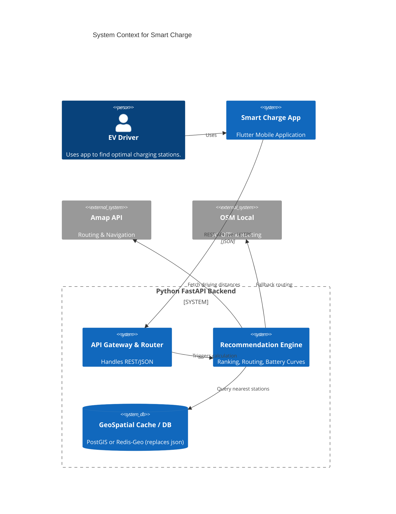

# Smart Charge 架构文档 (AI 驱动友好版)

> **Document Intention**: This document describes the v2 architecture of the Smart Charge application. It reflects the actual implemented system after Phase 1-5 refactoring.

---

## 1. 核心架构问题诊断 (已解决)

1.  ~~**上帝对象 (God Object)**~~ → 已拆分: `main.py` 仅负责初始化，核心逻辑分散到 `services/`
2.  ~~**数据耦合与性能瓶颈**~~ → 已优化: 使用内存缓存 + 异步并发请求
3.  ~~**同步/异步灾难**~~ → 已解决: 后端全面使用 `async/await` + `httpx.AsyncClient`
4.  ~~**无状态异常**~~ → 已解决: 全局 `BusinessException` + `global_exception_handler`

---

## 2. 目标架构概览 (Target Architecture Pattern)

采用 **Domain-Driven Design (领域驱动设计Lite)** 结合 **Layered Architecture (分层架构)**。

### 2.1 高纬度系统边界 (System Context)



---

## 3. 后端详细结构 (Backend v2)

**端口**: 8000 (开发环境)

### 3.1 目录规范 (Directory Tree)

```text
backend_v2/
├── app/
│   ├── main.py                  # APP 初始化：全局异常处理、CORS、路由注册
│   ├── core/
│   │   ├── config.py           # Pydantic BaseSettings (环境变量：AMAP_KEY 等)
│   │   └── exceptions.py       # BusinessException + 全局异常 handler
│   ├── api/
│   │   └── v1/
│   │       ├── router.py       # APIRouter 汇总
│   │       ├── stations.py     # /api/stations 接口
│   │       ├── vehicles.py     # /api/vehicles 接口
│   │       ├── recommend.py    # /api/recommend 接口 (核心推荐)
│   │       └── navigation.py   # /api/route 接口 (导航路径规划)
│   ├── schemas/
│   │   ├── request.py          # 入参 Pydantic 模型 (SearchRequest)
│   │   └── response.py         # 出参 Pydantic 模型 (BaseResponse[T])
│   ├── services/               # 业务逻辑层
│   │   ├── amap.py            # 高德地图 API (驾车路线/POI/周边) + 连接池复用
│   │   ├── battery.py         # 电池能耗模型 + 武汉分时电价
│   │   ├── weather.py         # Open-Meteo 气温 API (无 KEY)
│   │   ├── ranking.py         # 七维度综合评分算法
│   │   └── cache.py           # 推荐结果缓存 (TTL=60s, MD5 key, LRU)
│   └── repositories/
│       └── station_repo.py    # 充电站数据访问 + 异步加载
├── requirements.txt
└── .env                        # AMAP_KEY=xxx
```

### 3.2 关键实现说明

1.  **全局统一响应**: `BaseResponse[T]` 所有 API 返回结构统一为 `{"code": int, "message": str, "data": T}`
2.  **全局异常处理**: `BusinessException` 用于业务异常，`global_exception_handler` 兜底处理未捕获异常
3.  **高德服务 (`amap.py`)**: 封装驾车路径规划 (`get_driving_route`) 和周边搜索 (`get_amenities_around`)，使用 `httpx.AsyncClient` 连接池（max=20 keepalive=20）
4.  **异步 HTTP**: 使用 `httpx.AsyncClient` 配合 `async/await`，超时控制 3-5 秒

---

## 4. 推荐算法流程 (核心)

`/api/recommend` 接口采用**四阶段流水线**，每次请求完整经过：

```
Request → [阶段0: 缓存] → [阶段1: 初筛] → [阶段2: 高德路线] → [阶段3: 评分] → [阶段4: 生态] → Response
```

### 阶段0 · 缓存查询 (TTL=60s)

- 请求参数 (user_location, current_soc, target_soc, battery_capacity, energy_consumption, district_filter, type_filter, max_distance) → MD5 哈希 → 缓存 key
- **命中**：直接返回缓存数据（约 0ms，绕过所有计算）
- **未命中**：继续后续阶段，结果写入缓存

### 阶段1 · 快速初筛 (bounding box + 直线距离)

无任何外部 API 调用，纯内存计算：

1. **district / type 过滤**：单遍筛选
2. **Bounding Box 过滤**：lat ∈ [user_lat-0.45, user_lat+0.45]，lng ∈ [user_lng-0.52, user_lng+0.52]
3. **直线距离过滤**：Haversine 公式 < max_distance
4. **预估路线距离**：直线距离 × 1.35 作为粗估值

→ 候选集 `candidates[]`，按预估路线距离升序排列

### 阶段2 · 高德路线并发查询 (Top-5)

- candidates 取 Top-5，并发请求高德 `Driving Route` API (`asyncio.gather`)
- 获得：真实路线距离、polyline 折线坐标、预计时长
- 其余候选使用粗估路线距离 fallback
- **连接池复用**：`_client = httpx.AsyncClient(limits=...)` 模块级单例

### 阶段3 · 七维度综合评分

| 维度 | 评分函数 | 数据来源 |
|---|---|---|
| S_dist (距离) | 对数衰减 log(1+d) 归一化 | 高德路线 / Haversine fallback |
| S_price (电价) | Sigmoid 定价，参考武汉峰谷系数 | battery.py 分时电价模型 |
| S_wait (等待) | 指数衰减 e^(-wait/15) | 站点 availability.wait_time |
| S_power (功率) | 分段函数：≥120kW=100, 60-120=80, <60=60 | station.power_kw |
| S_fatigue (疲劳) | 时段惩罚系数（深夜/早高峰加权） | 当前时间 |
| S_parking (停车) | 免费=100，收费按小时折扣 | station.price.parking_fee |
| S_avail (可用) | 空闲桩占比加权 | station.availability |

**综合评分公式**：
```
score = 0.25×S_dist + 0.25×S_price + 0.20×S_wait + 0.15×S_power + 0.05×S_fatigue + 0.05×S_parking + 0.05×S_avail + bonus − penalty
```

**实时数据注入**：
- **气温**：Open-Meteo API (`weather.py`) → 电池热衰减系数 → 能耗校正
- **电价**：武汉峰谷分时系数 (`battery.py`) → S_price 动态系数

```
尖峰 (11-13, 18-20h): 系数 1.18 → 约 1.95 元/kWh
高峰 (8-11, 13-18h):  系数 1.08 → 约 1.78 元/kWh
平段 (7-8, 20-23h):   系数 1.00 → 约 1.65 元/kWh
谷段 (23-7h):         系数 0.52 → 约 0.86 元/kWh
```

**Insight 消息生成**：
- `🌟` 谷时低价推荐：电价 < 0.95 元/kWh
- `⏰` 等谷电提示：尖峰时段等待进谷省钱
- `⚠️` 尖峰/高峰时段预警
- `🌙` 谷时低价：到达谷时段
- `🛍️` 周边商铺：POI 数量 × 0.5 加分（上限 10 分）

### 阶段4 · 周边生态指数 (Top-5 并发)

- 取评分 Top-5，并发请求高德 POI 周边搜索（餐饮/购物/休闲）
- 店铺数量 > 0 触发 bonus_score（上限 10 分）
- 追加 Insight 消息：`🛍️ 周边{N}家店 ({品牌列表})`

### 最终输出

- 返回评分排序 Top-20 结果
- 每条结果包含：站点信息、评分、路线距离/时长、polyline、预估充电时间/费用、Insight 消息、是否可达
- 写入缓存（TTL=60s）

---

## 5. 前端结构 (Frontend app_v2)

**端口**: 8000 → 8001 (连接后端)

### 5.1 目录规范 (Directory Tree)

```text
app_v2/
└── lib/
    ├── main.dart               # 入口，初始化高德 SDK
    ├── home.dart               # 主页面 (地图 + 导航 + 推荐 StatefulWidget)
    └── ...
```

### 5.2 导航功能核心实现

**Constants** (home.dart):
```dart
const String _AMAP_ANDROID_KEY = "89feee20b4ad911ee8e1effc2a13bfd3";
const double _OFF_ROUTE_THRESHOLD_METERS = 50.0;    // 偏航阈值
const double _ARRIVAL_DISTANCE_METERS = 100.0;      // 到达判断距离
const double _GPS_ACCURACY_THRESHOLD = 25.0;        // GPS精度过滤阈值
const double _ARRIVAL_SPEED_THRESHOLD = 5.0;        // 到达判定速度上限 (km/h)
const int _ARRIVAL_CONFIRM_SECONDS = 3;             // 到达确认持续时间
```

**核心状态变量**:
- `_isOffRoute` - 是否偏航
- `_offRouteAlertShown` - 偏航提示已显示
- `_gpsAccuracy` - 当前GPS精度
- `_arrivalConfirmStart` - 到达确认开始时间
- `_currentSpeed` - 实时GPS速度

**核心方法**:

| 方法 | 功能 |
|---|---|
| `_startLocationTracking()` | 启动GPS追踪，精度>25m的定位被过滤 |
| `_checkDeviation()` | 偏航检测：计算点到polyline各段的距离，>50m判定偏航 |
| `_handleDeviation()` | 偏航重算：从当前位置重新规划路线 |
| `_calculateStepIndexByDistance()` | 根据实际路程距离精确计算当前步进索引 |
| `_fetchRoute()` | 调用后端 `/api/route` 获取导航路线 |
| `_onLocationUpdate()` | GPS更新回调：更新位置、速度、步进索引、偏航/到达检测 |

**导航UI状态流**:
1. 用户点击"导航" → `_fetchRoute()` 请求后端 → 显示路线 polyline
2. GPS更新 → `_onLocationUpdate()` → 更新地图中心、速度显示
3. 偏航检测 → `_checkDeviation()` → 弹出提示 + 自动重算
4. 到达检测 → 距离<100m + GPS精度<25m + 速度<5km/h 持续3秒 → 显示到达提示

### 5.3 推荐结果展示

后端返回数据在首页地图底部卡片展示，关键字段：

| 字段 | 用途 |
|---|---|
| `recommendations[].score` | 综合评分，决定排序 |
| `recommendations[].distance` | 路线距离 (km) |
| `recommendations[].duration` | 预计时长 (min) |
| `recommendations[].estimated_cost` | 预估充电费用 (元) |
| `recommendations[].insight` | 洞察消息，含电价/等待/周边信息 |
| `recommendations[].reachable` | 是否可到达（电量是否充足） |
| `recommendations[].route.path` | polyline 折线坐标，用于前端导航 |
| `recommendations[].route.steps` | 导航步骤详情 |

---

## 6. API 通信规范

### 6.1 统一响应格式

```json
{
  "code": 200,
  "message": "success",
  "data": { ... }
}
```

### 6.2 推荐接口

**POST /api/recommend**

```json
// Request
{
  "user_location": { "lat": 30.5, "lng": 114.3 },
  "current_soc": 35,
  "target_soc": 80,
  "battery_capacity": 60,
  "energy_consumption": 15,
  "max_distance": 30.0,
  "district_filter": [],
  "type_filter": [],
  "preference": {}
}

// Response
{
  "code": 200,
  "message": "success",
  "data": {
    "total": 128,
    "recommendations": [
      {
        "station": { ... },
        "score": 85.3,
        "distance": 8.2,
        "duration": 18,
        "estimated_charging_time": 42,
        "estimated_cost": 28.56,
        "insight": "🌟 谷时低价推荐(0.86元/kWh) | 🛍️ 周边12家店 (星巴克、麦当劳)",
        "reachable": true,
        "route": {
          "distance": 8.2,
          "duration": 18,
          "path": [[30.5, 114.3], ...],
          "method": "amap_route",
          "steps": [...]
        }
      }
    ]
  }
}
```

### 6.3 导航接口

**POST /api/route**
```json
// Request
{ "origin_lat": 39.9, "origin_lng": 116.4, "dest_lat": 39.8, "dest_lng": 116.5 }

// Response (成功)
{
  "code": 200,
  "message": "success",
  "data": {
    "distance_km": 12.5,
    "duration_min": 25,
    "polyline": [[39.9, 116.4], ...],
    "steps": [{ "action": "右转", "instruction": "...", "road": "...", ... }],
    "strategy": "时间最短且费用最少"
  }
}
```

---

## 7. 已完成优化项

* [x] **推荐结果缓存**：同一位置/参数请求 60s TTL 复用，减少高德 API 消耗
* [x] **四阶段推荐流水线**：缓存 → 初筛 → 高德路线 → 评分 → 生态
* [x] **两阶段路线查询**：直线距离快筛 Top-5 → 并发高德真实路线
* [x] **武汉分时电价模型**：尖峰/高峰/平段/谷段四档，动态到达时段计算
* [x] **实时气温校正能耗**：Open-Meteo API（无 KEY）→ 电池热衰减系数
* [x] **七维度综合评分**：距离(0.25) + 电价(0.25) + 等待(0.20) + 功率(0.15) + 疲劳(0.05) + 停车(0.05) + 可用(0.05)
* [x] **周边生态指数**：高德 POI 周边搜索 → 店铺数量加分（上限 10 分）
* [x] **偏航检测**：点到线段距离算法，阈值 50m
* [x] **偏航重算**：点击按钮从当前位置重新规划
* [x] **到达判断增强**：距离 + GPS精度 + 速度三条件确认
* [x] **GPS精度过滤**：精度 > 25m 的定位被忽略
* [x] **步进索引精确计算**：按实际路程距离累加而非线性插值
* [x] **导航加载死循环修复**：移除错误的 `_isLoading` guard
* [x] **后端 action_code 500修复**：处理空列表/字符串类型
* [x] **实时速度显示**：使用 GPS 真实速度而非平均速度

---

## 8. 技术栈总结

| 层级 | 技术 |
|---|---|
| 前端框架 | Flutter (Android) |
| 地图 SDK | 高德 Flutter SDK (amap_flutter_map) |
| 定位 | Geolocator (GPS) |
| 指南针 | flutter_compass |
| 后端框架 | FastAPI + Uvicorn |
| HTTP 客户端 | httpx (异步，连接池复用) |
| 数据校验 | Pydantic |
| 外部 API | 高德地图 REST API v3 |
| 气温数据 | Open-Meteo API (无 KEY) |
| 电价数据 | 武汉电网公开电价（2024 工商业用电） |
| 缓存 | 内存缓存 (TTL=60s, MD5 key, LRU-like eviction) |
