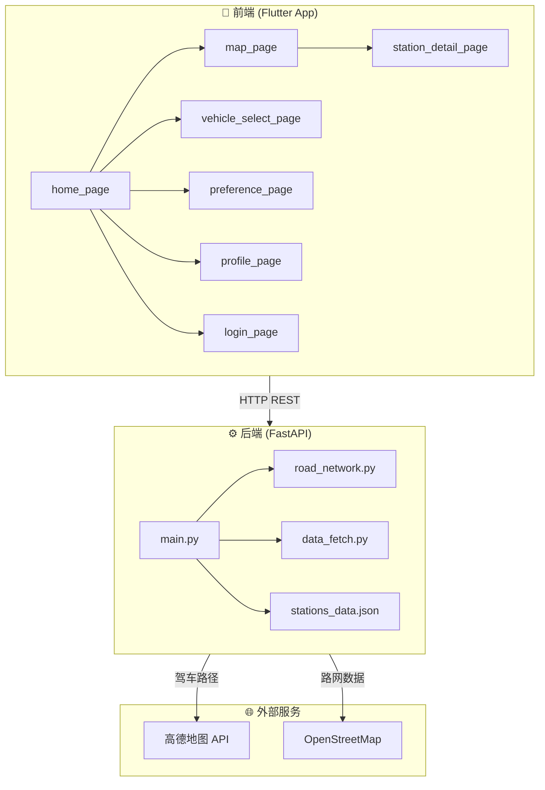

# Smart Charge — 充电桩路径导航优化系统 项目概览

## 📌 项目定位

这是一个**新能源汽车智能充电导航系统**，面向武汉地区，为电动车车主提供最优充电站推荐和路径规划。项目参加**智慧交通创新创业大赛**。

---

## 🏗️ 整体架构



---

## 📂 项目结构

| 目录 | 说明 |
|------|------|
| [app/smart_charge/](file:///c:/Users/28773/Desktop/Smart%20Charge/app/smart_charge) | Flutter 移动端应用 |
| [后端/](file:///c:/Users/28773/Desktop/Smart%20Charge/后端) | Python FastAPI 后端服务 |
| [icon_gen/](file:///c:/Users/28773/Desktop/Smart%20Charge/icon_gen) | Dart 图标生成工具 |

---

## ⚙️ 后端 (FastAPI + Python)

### 核心文件

| 文件 | 行数 | 说明 |
|------|------|------|
| [main.py](file:///c:/Users/28773/Desktop/Smart%20Charge/后端/main.py) | 905 行 | 主服务：API 接口、推荐算法、充电曲线模型 |
| [road_network.py](file:///c:/Users/28773/Desktop/Smart%20Charge/后端/road_network.py) | 294 行 | OSM 路网管理：A* 路径规划 |
| [data_fetch.py](file:///c:/Users/28773/Desktop/Smart%20Charge/后端/data_fetch.py) | ~350 行 | 充电站数据抓取 |
| [stations_data.json](file:///c:/Users/28773/Desktop/Smart%20Charge/后端/stations_data.json) | ~1.1MB | 武汉地区 982 个充电站数据 |

### 依赖

`FastAPI` + `Uvicorn` + `Pydantic` + `requests` + `osmnx` + `networkx`

### 核心 API 接口

| 方法 | 路径 | 说明 |
|------|------|------|
| GET | `/api/stations` | ⭐ **主接口**：多目标优化推荐充电站 |
| POST | `/api/recommend` | 个性化推荐（支持用户偏好权重） |
| GET | `/api/vehicles` | 获取车型品牌列表 |
| GET | `/api/vehicles/{brand}` | 获取品牌下车型列表 |
| GET | `/api/vehicle/{brand}/{model}` | 获取车型详细参数 |
| GET | `/api/station/{station_id}` | 获取充电站详情 |
| GET | `/api/stats` | 数据统计 |

### 核心算法

#### 1. 三级降级路径规划
```
高德地图 API (真实导航) → A* OSM 路网算法 (本地) → 系数估算 (兜底)
```

#### 2. 多目标加权评分
- **距离权重** (0.3): 距离越近越好
- **价格权重** (0.3): 电价 + 服务费越低越好
- **等待时间权重** (0.2): 排队等待越短越好
- **充电功率权重** (0.2): 功率越高越好
- 支持**超充偏好**加成

#### 3. 充电曲线模型
按 SOC 区间分段模拟充电功率变化，区分**三元锂**和**磷酸铁锂**电池：
- 10-20% SOC: 100% 峰值功率
- 70-80% SOC: 38% 功率（明显降速）
- 90-100% SOC: 15% 功率（涓流）

#### 4. 可达性判断
基于当前 SOC、电池容量、能耗计算最大行驶里程，保留 **30% 安全余量**。

### 车型数据库
内置 **15 个品牌、60+ 款**电动车数据（特斯拉、比亚迪、蔚来、小鹏、理想等），包含电池容量、能耗、最大充电功率、电池类型等参数。

---

## 📱 前端 (Flutter App)

### 技术栈
- **框架**: Flutter (Dart SDK ^3.5.0)
- **地图**: 高德地图 Flutter SDK (`amap_flutter_map` 3.0.0)
- **状态管理**: Provider
- **网络请求**: Dio
- **本地存储**: SharedPreferences
- **权限管理**: PermissionHandler

### 页面结构

| 页面 | 文件 | 说明 |
|------|------|------|
| 首页 | [home_page.dart](file:///c:/Users/28773/Desktop/Smart%20Charge/app/smart_charge/lib/pages/home_page.dart) | 充电站列表、筛选入口 |
| 地图页 | [map_page.dart](file:///c:/Users/28773/Desktop/Smart%20Charge/app/smart_charge/lib/pages/map_page.dart) | 高德地图展示充电站和路径 |
| 车型选择 | [vehicle_select_page.dart](file:///c:/Users/28773/Desktop/Smart%20Charge/app/smart_charge/lib/pages/vehicle_select_page.dart) | 品牌/车型选择 |
| 偏好设置 | [preference_page.dart](file:///c:/Users/28773/Desktop/Smart%20Charge/app/smart_charge/lib/pages/preference_page.dart) | 推荐权重调节 |
| 充电站详情 | [station_detail_page.dart](file:///c:/Users/28773/Desktop/Smart%20Charge/app/smart_charge/lib/pages/station_detail_page.dart) | 充电站详细信息 |
| 个人中心 | [profile_page.dart](file:///c:/Users/28773/Desktop/Smart%20Charge/app/smart_charge/lib/pages/profile_page.dart) | 用户信息 |
| 登录 | [login_page.dart](file:///c:/Users/28773/Desktop/Smart%20Charge/app/smart_charge/lib/pages/login_page.dart) | 登录页 |

### 业务层

| 模块 | 说明 |
|------|------|
| `services/api_service.dart` | Dio HTTP 封装 |
| `services/station_service.dart` | 充电站数据服务 |
| `services/vehicle_service.dart` | 车型数据服务 |
| `providers/user_provider.dart` | 用户状态管理 (Provider) |
| `models/station.dart` | 充电站数据模型 |
| `widgets/station_card.dart` | 充电站卡片组件 |
| `widgets/filter_sheet.dart` | 筛选面板组件 |

---

## 🗺️ 数据覆盖

- **地域**: 武汉市（汉口、武昌、汉阳三大区域）
- **充电站**: 982 个（含超充站、快充站、慢充站、目的地充电、专用充电站、换电站）
- **主要运营商**: 特来电、星星充电等
- **路网**: 基于 OSM 的武汉核心区域驾车路网

---

## 🔑 关键设计特点

1. **三级路径规划降级** — 保证高可用性
2. **充电曲线模型** — 精确预估充电时间，区分电池类型
3. **多目标优化推荐** — 综合距离/价格/等待/功率，支持个性化权重
4. **可达性安全判断** — 30% 电量安全余量
5. **批量+精确两阶段计算** — 全量站点简化模式筛选 → TopN 生成完整路径，提升性能
6. **丰富的车型数据库** — 内置 60+ 款主流电动车参数，自动匹配
